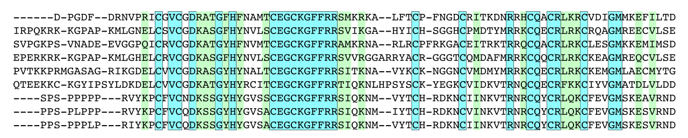

Introduction
=====

In order to find an optimal alignment between two sequences we defined a score system: we determine a score when two caracters are identical, another when they are not and another when a caracter is aligned with a gap. The final score of the aligment is the sum of all the scores. The optimal alignment is the one that has the higher score of all the possible alignments.

The user can enter 2 sequences that he wants to compare as well as the match score, the missmatch score and the score gap that he desire.

Indices and tables
==================

* :ref:`genindex`
* :ref:`modindex`
* :ref:`search`